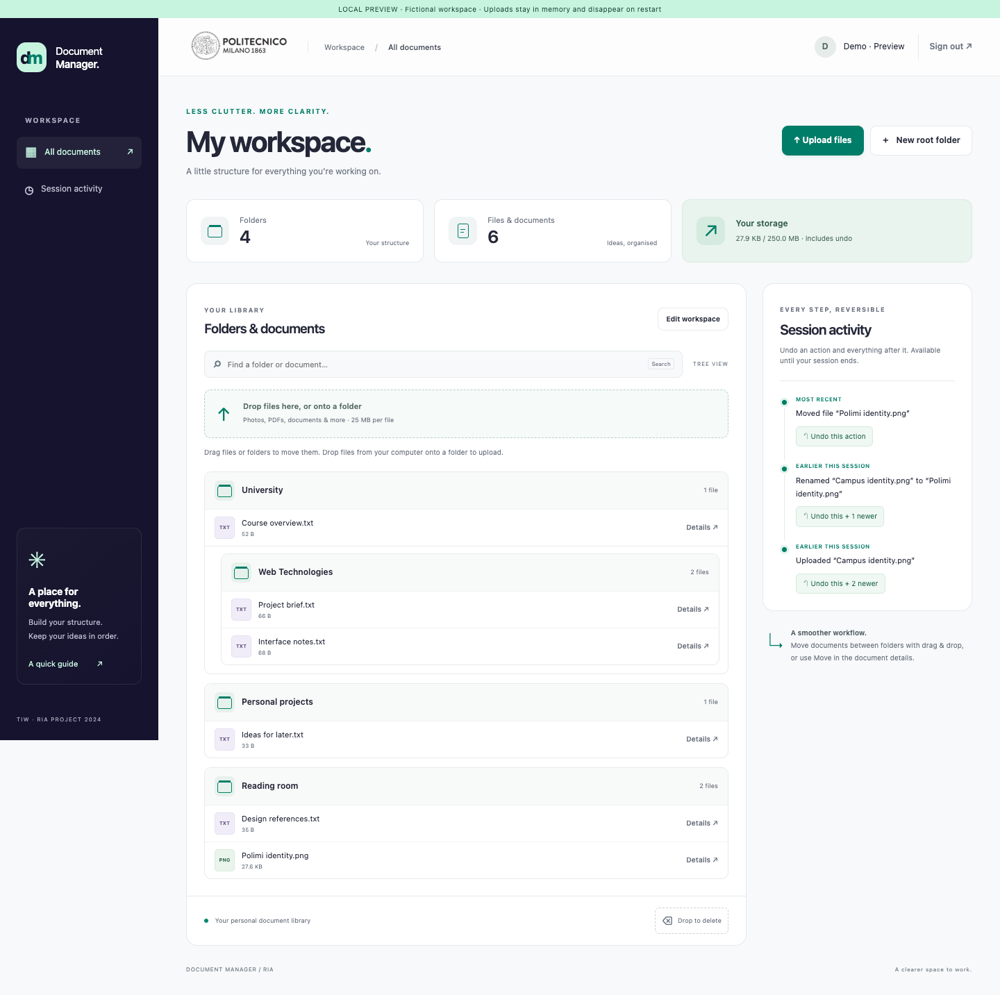

# Document Manager

Document Manager is a web application for organising personal folders and files. It uses Java Servlets, MySQL and vanilla JavaScript.

## Features

- Upload multiple files, download the original bytes and preview PNG, JPEG, GIF and WebP images.
- Create, rename, move, search and delete folders and documents. Drag and drop is supported alongside standard controls.
- Undo one or more actions from the current session, including file deletion and folder moves.
- Keep each account's files separate with server-side ownership checks.

Limits: 25 MiB per file, 20 files and 100 MiB per upload, 250 MiB per account. Undo history expires after five minutes of inactivity.

## Get started

Requires JDK 19+, Maven 3.9+, Tomcat 9 and MySQL 8+.

1. Create the database with `database/schema.sql` and a database account for the application.
2. Configure the database connection outside the repository using `config/document-manager.example.xml` as a template.
3. Build with `mvn clean verify` and deploy `target/document-manager.war` to Tomcat.
4. Open `/document-manager/index.html` on your Tomcat server and register an account.

See [setup](docs/setup.md) for commands and configuration details. For a local interface preview without MySQL, run `python3 scripts/preview.py` and open `http://127.0.0.1:8765/homepage.html`; preview data is temporary.

For a normal launch from Terminal or Finder, follow the [external startup guide](docs/avvio-esterno.md).

## Documentation

- [Setup and deployment](docs/setup.md)
- [External startup guide](docs/avvio-esterno.md)
- [Architecture and API](docs/architecture.md)
- [Testing](docs/testing.md)
- [Security](docs/security.md)

## License

Project code and documentation are licensed under the [Apache License 2.0](LICENSE). Bundled third-party libraries retain their own licenses. The Politecnico di Milano name and logos are trademarks of their respective owner; Apache 2.0 does not grant trademark rights.
